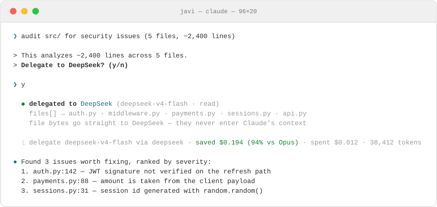
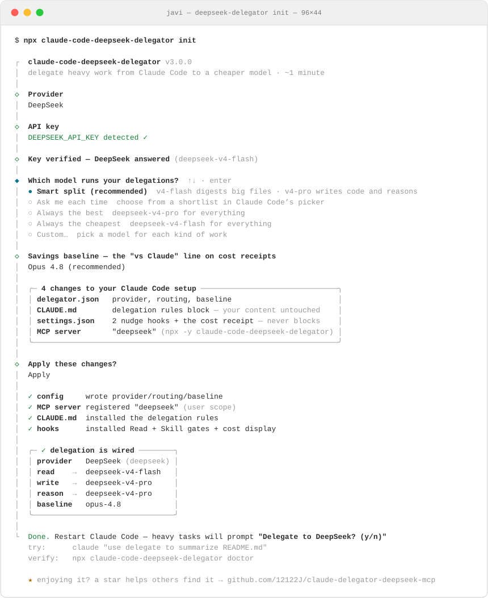

# Claude Code DeepSeek Delegator

> ### 🚀 3.0 is out — now model-agnostic
> One tool, **any model**: DeepSeek, Kimi, GLM, Qwen, Grok, Groq, OpenRouter, even your local ollama — and you can **mix them per task**. Plus a rebuilt interactive installer, a model picker inside Claude Code, and a receipt for every cent. v2 installs keep working untouched. **[See what's new ↓](#whats-new-in-30)**

**Cut your Claude Code bill by 90–97% on heavy work — big file audits, long generations, deep reasoning — by delegating it to a cheaper model without leaving your session.**

Claude orchestrates; the delegate does the grunt work (big file audits, long generations, deep reasoning) at a fraction of the price. One tool call, no subagent spawn, no daemon, zero dependencies.

**One command installs everything.** `init` is an interactive wizard that wires up the `delegate` tool, the automatic gate (the "Delegate to DeepSeek? (y/n)" nudge before heavy reads and skill loads), your provider + API key (live-validated), and how models get picked. Run it once, restart Claude Code, and delegation just happens.

<p>
  <a href="https://www.npmjs.com/package/claude-code-deepseek-delegator"></a>
  <a href="https://www.npmjs.com/package/claude-code-deepseek-delegator"></a>
  
  
  
</p>

> ⭐ **If this saves you money, please [star the repo](https://github.com/12122J/claude-delegator-deepseek-mcp).** It's the single biggest thing that helps other Claude Code users find it.



Every call ends with a receipt — shown to you automatically, straight from the API's own token counts. You always know what you spent and what you saved.

---

## What's new in 3.0

- **Any model, not just DeepSeek.** 8 providers vendored (DeepSeek, Moonshot/Kimi, Z.AI + Zhipu/GLM, Alibaba/Qwen, Groq, xAI/Grok, OpenRouter) plus any OpenAI-compatible endpoint you add — including local ollama/vllm for **$0 delegation**.
- **Mix and match providers.** Select several providers in one init (space in the picker), give each its key, then route digestion to GLM-flash, code generation to DeepSeek-pro, keep a Kimi in your shortlist. Keys live in a keyring that survives re-runs and provider switches.
- **A setup wizard that's actually nice.** Arrow-key rail UI, live API-key validation against the real endpoint, full disclosure before anything is written, one question for model strategy.
- **Pick the model your way.** Smart split (cheap model digests, big model creates), a shortlist picker rendered by Claude Code's own UI, always-best, always-cheapest, or fully custom per kind of work.
- **Honest receipts.** Cost per call from the provider's own token counts, cached tokens billed at cached rates, savings baseline of your choice (Opus, Sonnet, or off).
- **Nothing breaks.** The `deepseek` tool name, env var, and hooks from v2 all keep working. No config = exact v2 behavior.

---

## Install (one command)

```bash
npx claude-code-deepseek-delegator init
```

The wizard walks you through four choices — arrow keys, ~1 minute:

1. **Providers** — DeepSeek, Moonshot (Kimi), Z.AI / Zhipu (GLM), Alibaba (Qwen), Groq, xAI (Grok), OpenRouter, or any custom OpenAI-compatible endpoint (ollama, vllm, LM Studio, a proxy). Enter picks one; **space picks several** — enroll DeepSeek *and* Z.AI in the same run and mix them in step 3 (the first becomes the primary that names the gate).
2. **API keys** — one per chosen provider: detected from your environment, or paste it (hidden). The wizard **live-fires a 1-token request** so a bad key fails right there with the provider's real error, not on tomorrow's first delegation.
3. **Which model runs your delegations** — a smart split (the cheap model digests, the big one creates), a shortlist you pick from each time, always best / always cheapest, or custom (see below).
4. **Savings baseline** — measure savings against Opus 4.8, Sonnet 5, or don't show savings.

It then shows exactly what it will change, asks, applies, and prints a recap:



Sanity-check anytime:

```bash
npx claude-code-deepseek-delegator doctor
```

`doctor` doesn't just check that files exist — it **actually fires the gate hooks**, resolves every configured model against the registry, and confirms the delegation prompt is live.

### What `init` actually changes (full disclosure)

1. **`~/.claude/delegator.json`** — your provider, model routing, and savings baseline. Edit it anytime; changes apply on the next call, no restart.
2. **A clearly-labeled block in `~/.claude/CLAUDE.md`** — the delegation rules, fenced with `<!-- >>> ... >>> -->` markers. **Never touches anything else in your file.**
3. **Three hooks in `~/.claude/settings.json`** — two `PreToolUse` nudges (before large reads and skill loads) and one `PostToolUse` cost receipt. They **only add context or display info — they never block, delete, or modify your tool calls.**
4. **An MCP server** named `delegate` (`npx -y claude-code-deepseek-delegator`) — so Claude Code shows "Calling delegate…" on every call. v2's `deepseek` server key keeps working on untouched installs and is migrated automatically when you re-run init.

Before any of that, it writes a timestamped backup of every file it changes. To undo everything — including the config files:

```bash
npx claude-code-deepseek-delegator uninstall
```

---

## Which model does the work?

Not every delegation deserves your best model. "Summarize this 2,000-line file" is digestion — a cheap model does it fine. "Rewrite this module" is creation — you want the good one. Paying pro prices for flash work is where delegation savings quietly leak.

So the wizard asks one question — **"Which model runs your delegations?"** — with answers that map to how people actually think:

- **Smart split (recommended)** — the cheap model digests big files, the big model writes code and reasons. You never think about it again; the receipt shows which one ran.
- **Ask me each time** — you keep a shortlist, and when you approve a delegation Claude shows it through Claude Code's **native picker UI** (the same one `/model` uses) with prices. You tap the model, it delegates there.
- **Always the best / Always the cheapest** — one model for everything, zero decisions.
- **Custom** — pick a model per kind of work (`read` / `write` / `reason`), **mixing providers freely**: the menus list models from every provider whose key is detected, so "reads on GLM-flash, writes on DeepSeek-pro, reasoning on Kimi" is three arrow-key picks.

### What each choice feels like in a session

**Smart split.** You never see a model decision — the same y/n gives cheap digestion and quality creation:

```
❯ summarize what src/auth.py does            (2,100 lines)
> Delegate to DeepSeek? (y/n)  y
⎿ delegate deepseek-v4-flash via deepseek · saved $0.081 (94% vs Opus) · spent $0.005
                    ↑ digestion → the cheap model ran

❯ now rewrite it with proper token rotation
> Delegate to DeepSeek? (y/n)  y
⎿ delegate deepseek-v4-pro via deepseek · saved $0.152 (91% vs Opus) · spent $0.019
                    ↑ creation → the big model ran
```

**Ask me each time.** After your `y`, Claude opens Claude Code's picker with your shortlist and prices; your tap decides:

```
> Delegate to DeepSeek? (y/n)  y

  Which model?                       ← Claude Code's native picker
  ❯ deepseek-v4-flash   $0.14 / $0.28 per 1M
    deepseek-v4-pro     $0.435 / $0.87 per 1M
    moonshot:kimi-k2.5  $0.20 / $1.20 per 1M

⎿ delegate kimi-k2.5 via moonshot · saved $0.117 (88% vs Opus) · spent $0.016
```

**Always the best / cheapest.** Every delegation is the same model — exactly how v2 behaved, one price.

Under the hood every choice just writes `~/.claude/delegator.json`, which you can edit anytime — changes apply on the next call, no restart:

```jsonc
{
  "provider": "deepseek",
  "mode": "auto",                        // or "ask" for the shortlist picker
  "shortlist": ["deepseek-v4-flash", "deepseek-v4-pro", "moonshot:kimi-k2.5"],
  "routing": {
    "read":   "deepseek-v4-flash",       // digest/summarize big inputs
    "write":  "deepseek-v4-pro",         // generate code and docs
    "reason": "deepseek-v4-pro"          // math, logic, architecture
  },
  "baseline": "opus-4.8"
}
```

How the smart split works mechanically: Claude labels each delegation `task: "read" | "write" | "reason"`, the server looks the label up in `routing`, and that model id goes on the wire (this chain is covered by an end-to-end test against a mock provider). An explicit `model` argument — like the one your picker choice produces in ask mode — always beats the routing table. If Claude omits the label entirely, the provider's default large model runs: the failure mode is a price tier, never a crash.

## Providers

| Provider | id | Env var | Example models |
|----------|----|---------|----------------|
| DeepSeek | `deepseek` | `DEEPSEEK_API_KEY` | deepseek-v4-pro, deepseek-v4-flash |
| Moonshot | `moonshot` | `MOONSHOT_API_KEY` | kimi-k2.5, kimi-k2.7-code |
| Z.AI | `zai` | `ZAI_API_KEY` | glm-5, glm-4.7-flash |
| Zhipu | `zhipu` | `ZHIPU_API_KEY` | glm-5, glm-4.7 |
| Alibaba | `alibaba-singapore` | `ALIBABA_SINGAPORE_API_KEY` | qwen3.7-max, qwen3.6-flash |
| Groq | `groq` | `GROQ_API_KEY` | llama-4-maverick, kimi-k2 |
| xAI | `xai` | `XAI_API_KEY` | grok-4.5, grok-code-fast-2 |
| OpenRouter | `openrouter` | `OPENROUTER_API_KEY` | ~25 curated ids across every lab |

Provider definitions (endpoints, models, prices) follow the [catwalk](https://github.com/charmbracelet/catwalk) schema, vendored from charmbracelet's registry (MIT). Add your own in `~/.claude/delegator-providers.json` — any OpenAI-compatible endpoint works, including local ones:

```json
{
  "name": "Local Ollama", "id": "ollama", "type": "openai-compat",
  "api_key": "none", "api_endpoint": "http://localhost:11434/v1",
  "default_large_model_id": "qwen3-coder",
  "models": [{ "id": "qwen3-coder", "cost_per_1m_in": 0, "cost_per_1m_out": 0,
               "context_window": 128000, "default_max_tokens": 8192 }]
}
```

---

## Why this instead of spawning a subagent?

The usual pattern for heavy work — spawning a Claude subagent — starts a **brand new context window**: you re-pay the full context, lose your current state, and still bill at Claude rates.

This MCP server stays **in your current session**. Claude calls `delegate(...)` like any tool — no new context, no re-init, no spawn overhead — and the delegate does the heavy compute at a fraction of the rate.

## The `files[]` trick (this is the real win)

When Claude reads files and pastes them into a prompt, those bytes land in **Claude's** context first — you pay Claude's rate just to pass content through.

With `files[]`, Claude passes only the **paths**. The MCP server reads the bytes off disk and forwards them straight to the delegate. Large codebases never touch Claude's context.

```jsonc
// Claude calls the tool like this — no Read calls first:
delegate({
  prompt: "Audit these files for security vulnerabilities and rank by severity.",
  task: "read",
  files: ["/abs/path/auth.py", "/abs/path/middleware.py", "/abs/path/payments.py"]
})
```

Claude then **synthesizes** the answer for you instead of pasting it verbatim — so you get the conclusion, cheaply, in the same conversation.

## The cost receipt (you see every cent)

After every call, a one-line receipt is displayed to you:

```
delegate deepseek-v4-pro via deepseek · saved $0.2472 (96% vs Opus) · spent $0.0114 · 28,410 tokens
```

It's computed from the API's own token usage (cached prompt tokens billed at the cached rate) and shown by a `PostToolUse` hook — **deterministically, not by asking the model to remember.** Claude physically cannot swallow the number. The baseline is yours to choose: Opus 4.8, Sonnet 5, or off.

---

## Tools

### `delegate`

| Param | Type | Default | Description |
|-------|------|---------|-------------|
| `prompt` | string | *required* | The task for the delegate. Be specific. |
| `task` | string | — | `read` / `write` / `reason` — routes to the configured model. |
| `model` | string | routed | Override: bare id or `provider:model` (e.g. `openrouter:moonshotai/kimi-k2.5`). |
| `provider` | string | configured | Override the active provider by id. |
| `files` | string[] | — | Absolute paths. The server reads them — bytes never enter Claude's context. |
| `system` | string | — | Optional system prompt. |
| `temperature` | number | `0.3` | 0–2, lower = more deterministic. |
| `stream` | boolean | `false` | Stream chunks instead of buffering. Good for very large outputs. |

### `delegate_models`

Lists every provider with key status, models, context windows, and prices, plus your active routing.

### `deepseek` / `deepseek_models`

Aliases of the above — v2 names, kept working forever.

---

## CLI reference

```
npx claude-code-deepseek-delegator <command>

  (no command)   Run the MCP server (how Claude Code launches it)
  init           Interactive setup wizard: provider, key, routing, gate (asks first)
  doctor         Verify the install, resolve the config, live-fire the gate hooks
  uninstall      Cleanly remove everything init added (incl. delegator.json)
  help           Show help
  --version      Print version

  init flags:  --dry-run · --no-hooks · --yes ·
               --provider <id[,id…]> (first is primary) · --key <key> ·
               --preset balanced|cheapest|max · --mode auto|ask ·
               --baseline opus|sonnet|none
```

## Environment variables

| Variable | Default | Description |
|----------|---------|-------------|
| `<PROVIDER>_API_KEY` | — | Key for each provider (see the table above). |
| `DELEGATOR_CONFIG` | `~/.claude/delegator.json` | Config file location. |
| `DELEGATOR_TIMEOUT` | `120000` | Request timeout (ms). `DEEPSEEK_TIMEOUT` still works. |
| `DELEGATOR_MAX_RETRIES` | `2` | Retries on 429/5xx. `DEEPSEEK_MAX_RETRIES` still works. |
| `DEEPSEEK_API_HOST` | `api.deepseek.com` | v2 compat: overrides the DeepSeek hostname. |
| `CLAUDE_CONFIG_DIR` | `~/.claude` | Honored if you've relocated Claude's config. |

---

## Migrating from v2

**Nothing to do.** Existing installs keep working unchanged: the `deepseek` tool name, `DEEPSEEK_API_KEY`, the MCP server entry, and the installed hooks all still function, and with no config file the behavior is identical to v2 (DeepSeek v4-pro for everything). Run `init` once to unlock providers, task routing, and the shortlist picker.

## FAQ

**Does `npm install` alone enable the gate?** No. Installing only provides the binary. Run `init` to wire it in.

**Will it overwrite my CLAUDE.md?** Never. It appends one fenced block and shows you the exact text first. Everything else is left byte-for-byte.

**How do I remove it?** `npx claude-code-deepseek-delegator uninstall`. Clean and complete — MCP entry, rules, hooks, and config files.

**Is my key safe?** Use the env-var reference and it's never written to disk. Or paste the literal key if you prefer.

**Can I use two providers at once?** Yes — select both in the wizard's provider step (space toggles) and give each its key in the same run; the Custom and Shortlist menus then mix their models. Under the hood routing values and shortlist entries are `provider:model` specs, keys live as a keyring in the MCP env block (surviving re-runs and provider switches), and `doctor` verifies every referenced provider's key.

**Why is the package still called *deepseek*-delegator if it's model-agnostic?** it was initially only for deepseek. 12k installs a month depend on the npm name and the v2 tool alias. The engine is agnostic; the packaging keeps its name so nobody's setup breaks. (The MCP server itself registers as `delegate` since 3.0.)

## License

MIT. Provider registry data vendored from [charmbracelet/catwalk](https://github.com/charmbracelet/catwalk) (MIT).

Built by [Javi](https://github.com/12122J). If this saves you money, [a star](https://github.com/12122J/claude-delegator-deepseek-mcp) is the nicest way to say thanks — it's how other Claude Code users find it.
